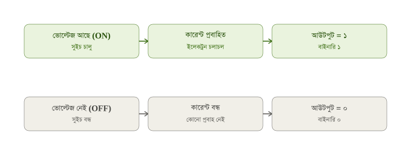
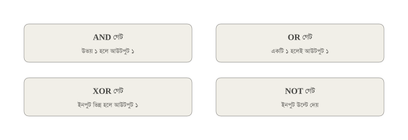
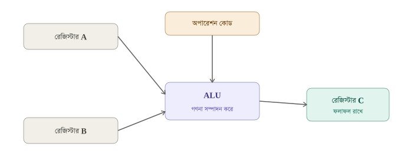
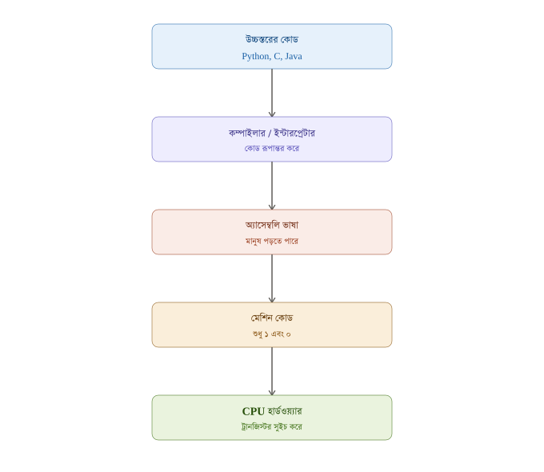

# হ্যালো ওয়ার্ল্ড থেকে সিপিইউ: কোড কীভাবে কাজ করে

প্রোগ্রামিং ভাষায় লেখা কোড কীভাবে কম্পিউটার হার্ডওয়্যারকে নির্দেশ দেয় এবং শেষ পর্যন্ত সিপিইউ-এর ভেতরে থাকা কোটি কোটি ট্রানজিস্টরকে নিয়ন্ত্রণ করে — এই গাইড সেই পুরো যাত্রাটা সহজ ভাষা, বাস্তব উপমা আর ডায়াগ্রাম দিয়ে ব্যাখ্যা করে। ইলেকট্রিসিটির সাধারণ সংকেত থেকে শুরু করে উচ্চস্তরের প্রোগ্রামিং কোড পর্যন্ত প্রতিটা ধাপ এখানে আছে।

## সূচিপত্র

- [১. বাইনারি নম্বর ও ইলেকট্রিসিটি](#১-বাইনারি-নম্বর-ও-ইলেকট্রিসিটি)
- [২. ট্রানজিস্টর](#২-ট্রানজিস্টর)
- [৩. লজিক গেট](#৩-লজিক-গেট)
- [৪. বাইনারি অ্যাডিশন ও এডার](#৪-বাইনারি-অ্যাডিশন-ও-এডার)
- [৫ ও ৬. ALU এবং রেজিস্টার](#৫-ও-৬-alu-এবং-রেজিস্টার)
- [৭. CPU ইনস্ট্রাকশন ও ল্যাঙ্গুয়েজ](#৭-cpu-ইনস্ট্রাকশন-ও-ল্যাঙ্গুয়েজ)
- [৮. ফেচ-ডিকোড-এক্সিকিউট সাইকেল](#৮-ফেচ-ডিকোড-এক্সিকিউট-সাইকেল)
- [৯. কন্ডিশনাল ও লুপ](#৯-কন্ডিশনাল-ও-লুপ)
- [১০. সম্পূর্ণ যাত্রা: কোড থেকে হার্ডওয়্যার](#১০-সম্পূর্ণ-যাত্রা-কোড-থেকে-হার্ডওয়্যার)
- [সম্পূর্ণ উদাহরণ: ৫ + ৩ কীভাবে হয়](#সম্পূর্ণ-উদাহরণ-৫--৩-কীভাবে-হয়)
- [উপসংহার](#উপসংহার)

---

## ১. বাইনারি নম্বর ও ইলেকট্রিসিটি

কম্পিউটার আসলে একটা "বোকা" মেশিন — এটা শুধু দুটো জিনিস বোঝে: **বিদ্যুৎ আছে** নাকি **বিদ্যুৎ নেই**। এইটুকু দিয়েই পুরো ডিজিটাল দুনিয়া তৈরি।

একটা ঘরের লাইট সুইচের কথা ভাবো — সুইচ অন করলে বাল্ব জ্বলে, অফ করলে নেভে। মাঝামাঝি কোনো অবস্থা নেই। এই দুই অবস্থাকেই আমরা সংখ্যায় লিখি:

- বিদ্যুৎ আছে = **১**
- বিদ্যুৎ নেই = **০**

কম্পিউটার কেন দশমিক (0-9) সংখ্যা ব্যবহার না করে শুধু ০ আর ১ ব্যবহার করে? কারণ সার্কিটে ভোল্টেজের অনেকগুলো লেভেল নির্ভুলভাবে আলাদা করে চেনা কঠিন ও ভুলপ্রবণ। কিন্তু "ভোল্টেজ আছে" বনাম "ভোল্টেজ নেই" — এই দুইটা অবস্থা আলাদা করা অনেক বেশি নির্ভরযোগ্য। তাই পুরো ডিজিটাল জগৎ বাইনারি (base-2) সিস্টেমের উপর দাঁড়িয়ে আছে।

**উদাহরণ:** দশমিক সংখ্যা ৫ কে বাইনারিতে লেখা হয় `101` (৪+০+১ = ৫)। প্রতিটা অবস্থান ২-এর ঘাত প্রতিনিধিত্ব করে — ঠিক যেমন দশমিকে প্রতিটা অবস্থান ১০-এর ঘাত প্রতিনিধিত্ব করে।



---

## ২. ট্রানজিস্টর

উপরের চিত্রের "সুইচ"-টাই বাস্তবে হলো **ট্রানজিস্টর**। এটাকে কল্পনা করো একটা পানির কলের মতো — একটা তার (গেট) দিয়ে বলে দেওয়া হয় কল খোলা থাকবে নাকি বন্ধ থাকবে।

- ট্রানজিস্টরের ৩টা পা থাকে: **সোর্স**, **গেট**, **ড্রেইন**।
- গেটে ভোল্টেজ দিলে সোর্স থেকে ড্রেইনে কারেন্ট যেতে পারে (সুইচ অন)।
- গেটে ভোল্টেজ না দিলে পথ বন্ধ থাকে (সুইচ অফ)।

একটা আধুনিক প্রসেসরে প্রায় **১০-২০ বিলিয়ন** এরকম ট্রানজিস্টর থাকে, এবং প্রতিটা এত ছোট যে খালি চোখে দেখাই যায় না — কয়েক ন্যানোমিটার (একটা চুলের ব্যাসের দশ হাজার ভাগের এক ভাগের চেয়েও ছোট)!

> সিলিকন চিপের ভেতরে সত্যিকারের ট্রানজিস্টরের প্যাটার্ন কেমন দেখতে হয় তা দেখতে চাইলে: [Wikimedia Commons – Silicon die photography](https://commons.wikimedia.org/wiki/Category:Semiconductor_die_photography)।

---

## ৩. লজিক গেট

কয়েকটা ট্রানজিস্টরকে বিশেষভাবে সাজালে সেগুলো একসাথে একটা "সিদ্ধান্ত" নিতে পারে — একে বলে **লজিক গেট**।

| গেট | নিয়ম | বাস্তব উপমা |
|---|---|---|
| AND | দুটো ইনপুটই ১ হলে তবেই আউটপুট ১ | দুই হাতে দুইটা চাবি ঘোরালে তবেই সিন্দুক খুলবে |
| OR | যেকোনো একটা ইনপুট ১ হলেই আউটপুট ১ | দুই সুইচের যেকোনোটা টিপলেই বাতি জ্বলবে |
| XOR | দুটো ইনপুট আলাদা হলে আউটপুট ১ | দুইজন একমত না হলে সিদ্ধান্ত পরিবর্তন হয় |
| NOT | ইনপুট উল্টে দেয় | আয়নার প্রতিফলনের মতো — উল্টো দেখায় |



---

## ৪. বাইনারি অ্যাডিশন ও এডার

লজিক গেট দিয়ে সত্যিকারের গণিত করা যায়। দুটো বাইনারি বিট যোগ করলে:

```
0 + 0 = 0
0 + 1 = 1
1 + 0 = 1
1 + 1 = 10   (দশমিকে ২, বাইনারিতে ক্যারি সহ)
```

লক্ষ্য করো — যোগফলের প্যাটার্নটা ঠিক **XOR গেটের** নিয়মের মতো (ইনপুট আলাদা হলে ১), আর "ক্যারি" হয় ঠিক **AND গেটের** নিয়মের মতো (দুটোই ১ হলে তবেই ক্যারি)। তাই একটা XOR আর একটা AND গেট পাশাপাশি বসিয়ে বানানো হয় **হাফ এডার**:


হাফ এডার শুধু দুইটা বিট যোগ করতে পারে, আগের ক্যারি হিসাবে নিতে পারে না। বাস্তবে ব্যবহার হয় **ফুল এডার** — তিনটা ইনপুট নেয় (A, B, আগের ক্যারি), এবং বানানো হয় দুইটা হাফ এডার + একটা অতিরিক্ত OR গেট জোড়া দিয়ে। এরকম অনেকগুলো ফুল এডারকে সারিবদ্ধভাবে জোড়া দিলে ৮-বিট, ৩২-বিট, এমনকি ৬৪-বিট সংখ্যাও যোগ করা যায় — ঠিক যেভাবে কাগজে-কলমে বড় সংখ্যা যোগ করার সময় ডান থেকে বাম দিকে হাতে ক্যারি বহন করা হয়।

---

## ৫ ও ৬. ALU এবং রেজিস্টার

এতগুলো এডার আর গেট একসাথে জড়ো করে বানানো হয় **ALU (Arithmetic Logic Unit)** — CPU-র ভেতরের আসল ক্যালকুলেটর। এটা যোগ, বিয়োগ, তুলনা, AND/OR ইত্যাদি লজিক্যাল অপারেশন করতে পারে।

ALU-র নিজের কোনো মেমরি নেই — কাজ শেষে ফলাফল কোথাও রাখতে হয়। এই কাজের জন্য আছে **রেজিস্টার** — CPU-র ভেতরে থাকা অতি দ্রুতগতির ছোট্ট স্টোরেজ বক্স, ঠিক যেন একটা পকেট নোটবুক।



একটা ৮-বিট রেজিস্টার ০ থেকে ২৫৫ পর্যন্ত সংখ্যা রাখতে পারে (কারণ ২⁸ = ২৫৬টা সম্ভাব্য মান)। CPU যখন ৩২-বিট বা ৬৪-বিট বলা হয়, তার মানে তার রেজিস্টার আর ডাটাপথ একসাথে ৩২ বা ৬৪টা বিট বহন করতে পারে — যত বেশি বিট, তত বড় সংখ্যা একবারে হ্যান্ডেল করা যায়।

---

## ৭. CPU ইনস্ট্রাকশন ও ল্যাঙ্গুয়েজ

CPU ইংরেজি বা পাইথন বোঝে না, শুধু বাইনারি ইনস্ট্রাকশন বোঝে। একটা মেশিন কোড ইনস্ট্রাকশনে সাধারণত দুটো অংশ থাকে:

- **অপকোড (opcode):** কোন কাজ করতে হবে (যোগ, বিয়োগ, লোড, স্টোর ইত্যাদি)
- **অপারেন্ড (operand):** কোন রেজিস্টার বা মেমরি ঠিকানা নিয়ে কাজ করতে হবে

বাইনারিতে `00000001 00000010 00000011` লেখাটার মানে হতে পারে "রেজিস্টার ২ আর ৩ যোগ করে রেজিস্টার ১-এ রাখো"। মানুষের পক্ষে শত শত বাইনারি স্ট্রিং মনে রাখা অসম্ভব — তাই তৈরি হয়েছে **অ্যাসেম্বলি ভাষা**, যেখানে একই নির্দেশ লেখা হয়:

```asm
ADD R1, R2, R3
```

একটা প্রোগ্রাম, **অ্যাসেম্বলার**, এই মানুষ-পঠনযোগ্য কোডকে সরাসরি বাইনারি মেশিন কোডে রূপান্তর করে দেয়।

---

## ৮. ফেচ-ডিকোড-এক্সিকিউট সাইকেল

একটা প্রোগ্রাম হাজার হাজার নির্দেশের সমষ্টি। CPU এগুলো একটার পর একটা করে, ঘড়ির কাঁটার মতো নিয়মিত চক্রে। ধরো CPU একজন রাঁধুনি, আর প্রোগ্রামটা একটা রেসিপি বই:

1. **ফেচ (Fetch):** রাঁধুনি রেসিপি বইয়ের যে পাতায় আছে (এই পাতার ঠিকানা রাখে **প্রোগ্রাম কাউন্টার**), সেখান থেকে পরবর্তী নির্দেশটা পড়ে আনে।
2. **ডিকোড (Decode):** নির্দেশটা বিশ্লেষণ করে বোঝে কোন অপারেশন, কোন রেজিস্টার লাগবে।
3. **এক্সিকিউট (Execute):** ALU আর রেজিস্টার ব্যবহার করে আসল কাজটা সম্পন্ন করে।

তারপর প্রোগ্রাম কাউন্টার এক ধাপ বেড়ে যায়, আর পুরো চক্রটা আবার শুরু হয় — প্রতি সেকেন্ডে কোটি কোটি বার!


---

## ৯. কন্ডিশনাল ও লুপ

সাধারণত CPU একের পর এক নির্দেশ পালন করে (প্রোগ্রাম কাউন্টার প্রতিবার ১ করে বাড়ে)। কিন্তু `if` স্টেটমেন্ট বা `loop` থাকলে সেই নিয়ম ভাঙতে হয়। এর জন্য আছে **জাম্প (Jump)** ইনস্ট্রাকশন — এটা সরাসরি প্রোগ্রাম কাউন্টারের মান বদলে দেয়।

```
যদি (x > ৫) তাহলে
    নির্দেশ ৫০ নম্বরে যাও
নাহলে
    পরের নির্দেশ চালিয়ে যাও
```

CPU এটাকে অ্যাসেম্বলিতে দেখে: ALU দিয়ে তুলনা (`compare`) করা হয়, তারপর একটা কন্ডিশনাল জাম্প ইনস্ট্রাকশন (যেমন `JE` = Jump if Equal, `JG` = Jump if Greater) শর্তটা সত্য কিনা চেক করে। সত্য হলে প্রোগ্রাম কাউন্টারে সরাসরি ৫০ বসিয়ে দেয় — CPU লাফ দিয়ে সেই নির্দেশে চলে যায়। **লুপ** ঠিক একই কৌশল — শর্ত সত্য থাকা পর্যন্ত প্রোগ্রাম কাউন্টার বারবার পেছনের একই নির্দেশে ফিরে যায়।

---

## ১০. সম্পূর্ণ যাত্রা: কোড থেকে হার্ডওয়্যার

তুমি যখন C, Python বা Java-তে কোড লেখো, সেটা সরাসরি CPU-তে চলে না — এর মধ্যে বেশ কয়েকটা ধাপ আছে:



**একটা গুরুত্বপূর্ণ পার্থক্য:** C বা Rust-এর মতো "কম্পাইলড" ভাষা পুরো প্রোগ্রামটাকে আগে থেকেই মেশিন কোডে রূপান্তর করে ফেলে (একটা এক্সিকিউটেবল ফাইল তৈরি হয়), আর Python-এর মতো "ইন্টারপ্রেটেড" ভাষা লাইন-বাই-লাইন পড়ে সাথে সাথে রূপান্তর করে চালায় — তাই Python একটু ধীর, কিন্তু লেখা সহজ।

---

## সম্পূর্ণ উদাহরণ: ৫ + ৩ কীভাবে হয়

1. তুমি কোডে লিখলে `result = 5 + 3`
2. কম্পাইলার/ইন্টারপ্রেটার এটাকে অ্যাসেম্বলি নির্দেশে বদলায়: `ADD R1, R2, R3`
3. অ্যাসেম্বলার এটাকে বাইনারি মেশিন কোডে রূপান্তর করে মেমরিতে রাখে
4. CPU **ফেচ** করে নির্দেশটা মেমরি থেকে নিয়ে আসে
5. **ডিকোড** করে বোঝে — এটা যোগের কাজ, রেজিস্টার R2 (=৫) আর R3 (=৩) নিয়ে
6. **এক্সিকিউট** ধাপে রেজিস্টার থেকে ৫ আর ৩ ALU-তে পাঠানো হয়
7. ALU-র ভেতরের ফুল এডারগুলো (XOR আর AND গেটের সমন্বয়ে) বিট-বাই-বিট যোগ করে ৮ বের করে
8. এই যোগফল লক্ষ লক্ষ ট্রানজিস্টরকে নির্দিষ্ট প্যাটার্নে অন/অফ করার মধ্য দিয়ে ঘটে
9. ফলাফল ৮ রেজিস্টার R1-এ জমা হয়
10. প্রোগ্রাম কাউন্টার বেড়ে যায়, CPU পরবর্তী নির্দেশে চলে যায়

---

## উপসংহার

তুমি যা-ই কোড লেখো না কেন — একটা সিম্পল ক্যালকুলেটর অ্যাপ হোক বা একটা AI মডেল — শেষমেশ সবকিছু এই একই যাত্রা দিয়ে যায়:

**বিদ্যুৎ → ট্রানজিস্টর → লজিক গেট → এডার/ALU → রেজিস্টার → ইনস্ট্রাকশন → ফেচ-ডিকোড-এক্সিকিউট চক্র**

একটা আধুনিক CPU আসলে বিলিয়ন বিলিয়ন ট্রানজিস্টরের সুইচিং-এর এক বিশাল অর্কেস্ট্রা। তুমি যখন কোড রান করো, তখন তুমি আসলে সেই অর্কেস্ট্রাকে অত্যন্ত নিখুঁতভাবে পরিচালনা করছ — শুধু একটা "উচ্চস্তরের ভাষা" ব্যবহার করে, যাতে তোমাকে নিজে হাতে কোটি কোটি অন/অফ সংকেত লিখতে না হয়।

---

## লাইসেন্স

এই গাইড [MIT License](LICENSE)-এর অধীনে মুক্তভাবে ব্যবহার, কপি ও শেয়ার করা যাবে।
